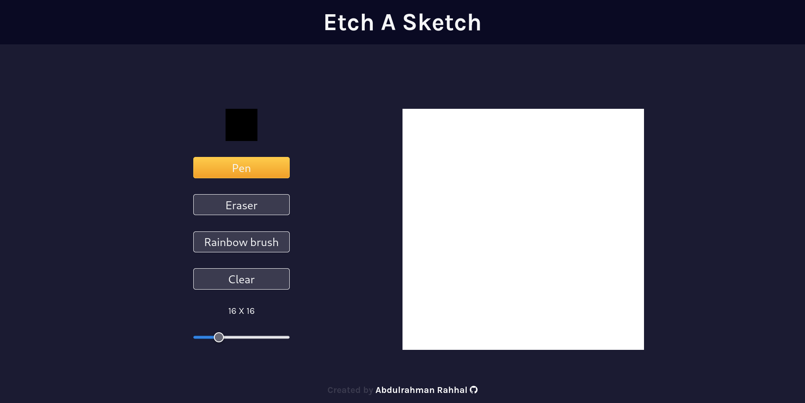

# Etch A Sketch

This is a Practice Project and it is part of [The Odin Project](https://www.theodinproject.com/) Course.

## Table of contents

- [Overview](#overview)
  - [Screenshot](#screenshot)
  - [Links](#links)
- [My process](#my-process)
  - [Built with](#built-with)
  - [What I learned](#what-i-learned)

## Overview
This web applecation is a very basic paint app, it has the basic functionalites like select the color, the grid template pixels, eraser and clear the board buttons.

### Screenshot

### Links

- Solution URL: [solution URL](https://github.com/rahhaly/Etch-A-Sketch/)
- Live Site URL: [live site URL](https://rahhaly.github.io/Etch-A-Sketch/)

## My process

1. Create the HTML structure.
2. Style it using CSS
3. Use Javascript to Manipulate the DOM Using Events Listeners
4. Create necessary functions and Assign Etch one with specific event or button.

### Built with

- Semantic HTML5 markup
- CSS custom properties
- Flexbox
- CSS Grid
- [Styled Components](https://styled-components.com/) - For styles
- Vanilla Javascript.

### What I learned

Use somthing like Function Programming Style to deal with various events and tasks.
Increase my confident to manipulate the DOM using javascript.
The power of link Javascript, Css and HTML together.
